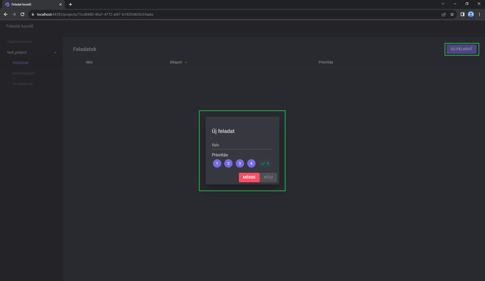
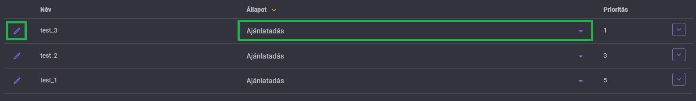
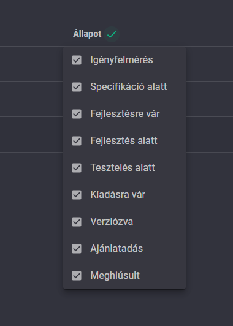
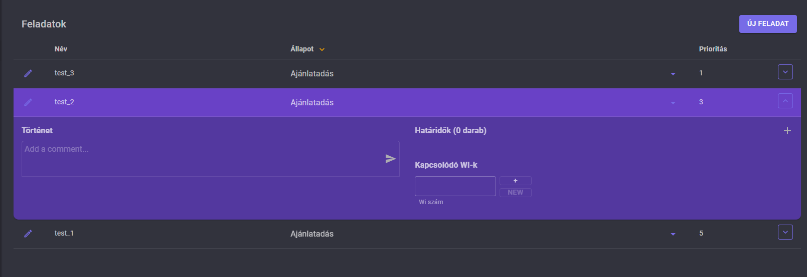
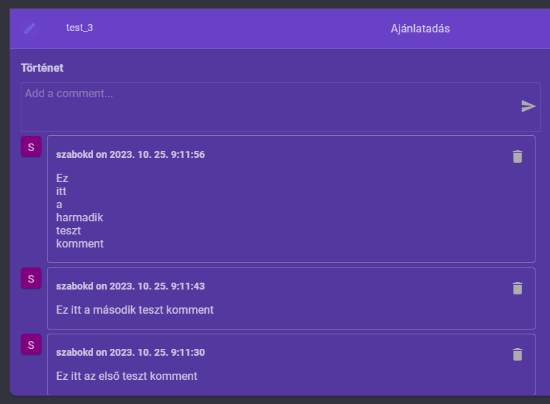
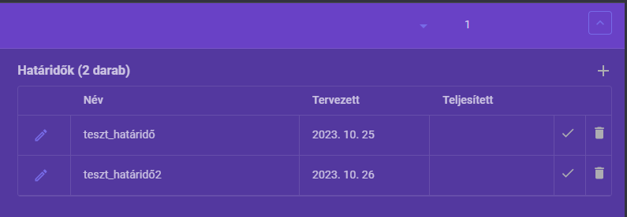
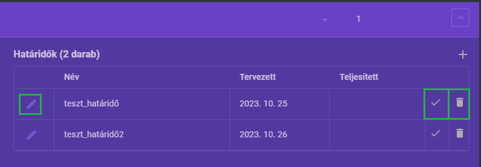
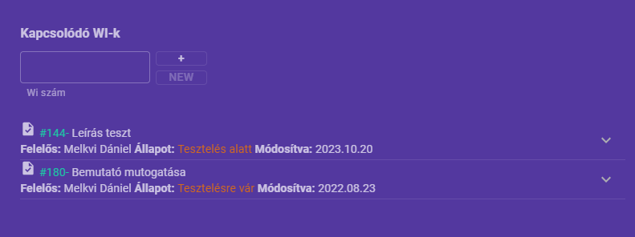
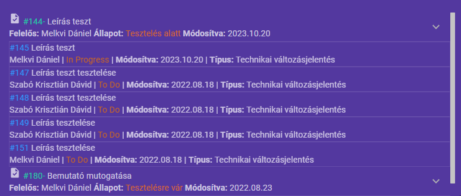

# TaskManager
verzió: 1.0

## Felhasználói segédlet
A TaskManager egy feladatkezelő program, ami egyszerűbbé teszi az aktuális feladatok **átláthatóságát** és **dokumentálását**.

### Kezdőoldal

- **Saját projectjeim:** itt azok a projectek találhatók meg, amik általunk lettek létrehozva vagy felvettük őket sajátnak.
- **Összes project:** itt az összes project megtalálható, ami létre lett hozva a TaskManagerben.
- **Felvétel a saját projectekhez:** Az "összes project" menüponton a könyvjelző ikonra kattintva a projectet hozzá adhatjuk a saját projectek listához. Ilyenkor be kerül a saját projectek menüpontba a project.
- **Új project:** projectet, a jobb felső sarokban lévő "Új project" gomb megnomásával lehet létrehozni. A felugró ablakban csak a project nevét kell megadni. (FONTOS: nem szerepelhet két ugyanolyan nevű project az alkalmazásban. Erre egy figyelmeztető üzenet is felhívja a figyelmed!).

### Projectoldal
- Az új project létrehozása után, ha bele kattintunk a projectbe, egy teljesen üres táblázat fogad:

- **Új feladat:** a projectet részfeladatokra tudjuk bontani az "Új feladat" gomb megnyomásával. A felugró ablakban be tudjuk állítani a feladat nevét (FONTOS: itt sem szerepelhet két ugyanolyan nevű feladat), illetve prioritását (1-5).

### Feladatnézet

- A ceruza ikonra kattintva szerkeszthető a feladat neve, illetve a prioritása.
- A feladat állapotára kattintva megjelenik egy lenyíló menü, ahol manuálisan állíthatjuk be, hogy milyen státuszban van jelenleg a feladat.

- Az "állapot" mellett lévő lefele nyílra kattintva megjelenik egy filter. Itt szabadon válaszhatunk, hogy milyen státuszú feladatokat szeretnénk látni. Értelem szerűen, amelyik állapot ki van pipálva az megjelenik, a többi nem.
- Ha kipipáltuk azokat az állapotokat, amiket látni szeretnénk, a zöld pipa ikonra kattintva elmenthetjük és automatikusan frissül a táblázat.

- A szükséges feladatok létrehozása után, a feladaton szereplő lefele nyíl segítségével megnyithatjuk a feladat részleteit.

- Minden feladat három részre bontható:

### Történet

- Ebben a részben a feladatokban történő változásokat tudjuk vezetni, így dátum szerint követhető, hogy mikor, milyen módosítások mentek végbe az adott feladaton.
- Törölni csak a saját kommentünket lehet.

### Határidők

- Ebben a részben a feladatokhoz határidőket lehet felvenni. Határidő hozzáadását a "+" gombbal tehetjük meg. Meg kell adni a nevét, illetve a dátumot.
- Nem állíthatunk be múltbeli dátumot, erre a program is figyelmeztet.
- Nem szerepelhet két ugyanolyan nevű határidő egy feladatban.

Határidő szerkesztése:

- A bal oldali ceruza ikonra kattintva a határidő neve szerkeszthető. Itt sem lehet megadni már létező nevet.

Határidő lezárása:

- A pipa ikonra kattintva a határidő lezárható. A lezárás nem vonható vissza. Erre egy felugró ablak is figyelmeztet, ha az ikonra kattintunk.

Határidő törlése:

- A kuka ikonra kattintva a határidő törölhető. A törlés nem vonható vissza. Erre egy felugró ablak is figyelmeztet, ha az ikonra kattintunk.

### Kapcsolódó workitemek

- Minden feladathoz hozzá kapcsolhatunk Azure DevOpsban létrehozott igény típusú workitemeket. Ezt úgy tehetjük meg, hogy a szövegdobozba beírjuk a workitem számát, majd rákattintunk a "+" gombra.
- A hozzáadott workitem számára kattintva új lapon megnyílik maga a workitem.
- A workitem státuszát a child workitemek határozzák meg, amiket a lefele nyílra kattintva érhetünk el.

- A képen látszik, hogy a "Leírás teszt" éppen "In progress" státuszban van (Ez az Azure DevOps státusza) és a többi workitem "To Do", ezért az igény státusza "Tesztelés alatt".
- Lehetséges workitem státuszok:
    - Ha a children workitem rendszerszervezési feladat:
        - To Do: Specifikációra vár
        - In Progress: Specifikáció alatt
        - Done: Specifikáció kész
    - Ha a children workitem fejlesztési feladat:
        - To Do: Fejlesztésre vár
        - In Progress: Fejlesztés alatt
        - Done: Fejlesztés kész
    - Ha a children workitem technikai változásjelentés:
        - To Do: Tesztelésre vár
        - In Progress: Tesztelés alatt
        - Kiadásra vár: Kiadásra vár
        - Done: Kiadva
    - Ha a children workitem hibajegy:
        - New: Hibajavításra vár
        - In Progress: Hibajavítás alatt
        - Done: Hibajavítás kész